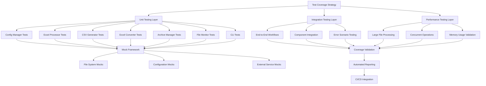

# Design Document - 90% Test Coverage Achievement

## Overview

This design document outlines the comprehensive implementation approach for achieving and maintaining 90% test coverage across the Excel-to-CSV converter project. The current coverage stands at 35.21% (954/2710 statements), requiring coverage of an additional 1485 statements to reach the 90% target (2439/2710 statements).

The design focuses on systematic testing enhancement for seven critical modules: Config Manager, Excel Processor, CSV Generator, Excel Converter, Archive Manager, File Monitor, and CLI. The approach leverages existing successful test patterns from high-coverage modules (System Prompt Loader: 100%, Logger: 87%) while implementing comprehensive testing strategies for complex file I/O operations, async processing, and component integration.

## Steering Document Alignment

### Technical Standards (tech.md)

The design follows documented technical patterns and standards:
- **Python 3.11+ Standards**: Utilizes modern type hints, improved performance features, and pytest framework (>= 7.0.0)
- **Testing Framework**: Builds on established pytest ecosystem with fixtures and parametrization support
- **Code Quality**: Implements pytest-cov (>= 4.0.0) for coverage reporting with HTML output capabilities
- **Architecture Patterns**: Follows event-driven pipeline architecture with modular component design
- **Performance Requirements**: Test execution completes within 5 minutes; coverage reports generate within 30 seconds

### Project Structure (structure.md)

Implementation follows project organization conventions:
- **Test Structure**: Mirrors src layout with tests/ directory containing unit/, integration/, and performance/ subdirectories
- **Naming Conventions**: Uses snake_case for test modules (test_excel_processor.py) and PascalCase for test classes (TestExcelProcessor)
- **Import Patterns**: Follows PEP 8 ordering with explicit imports and proper module boundaries
- **Documentation Standards**: Implements Google-style docstrings with comprehensive type hints

## Code Reuse Analysis

### Existing Components to Leverage

- **Existing Fixtures (conftest.py)**: Leverages established fixtures including temp_dir, sample_config_dict, sample_excel_data, env_override for consistent test setup
- **Successful Test Patterns**: Adopts patterns from high-coverage modules including comprehensive mocking strategies and edge case coverage
- **Testing Utilities**: Utilizes existing test helper functions for file creation, data validation, and environment setup
- **Coverage Infrastructure**: Builds upon existing pytest-cov configuration and reporting mechanisms

### Integration Points

- **pytest Framework**: Integrates with existing test runner configuration and fixture management
- **Coverage Reporting**: Connects to established coverage analysis pipeline with HTML, XML, and terminal output formats
- **CI/CD Pipeline**: Leverages existing automated testing infrastructure with coverage threshold enforcement
- **Mock Strategies**: Extends current mocking approaches for file system operations and external dependencies

## Architecture

The testing architecture implements a comprehensive multi-layered approach designed to achieve systematic coverage improvement across all critical modules:



## Components and Interfaces

### Config Manager Test Suite
- **Purpose:** Comprehensive testing of configuration loading, validation, and environment integration
- **Target Coverage:** 85% (currently 13.47%, requires 121+ additional statements)
- **Interfaces:** 
  - `test_config_loading()` - YAML file parsing and validation
  - `test_environment_overrides()` - Environment variable integration
  - `test_validation_scenarios()` - Configuration validation logic
  - `test_error_handling()` - Invalid configuration scenarios
- **Dependencies:** PyYAML mocking, file system mocks, environment variable fixtures
- **Reuses:** Existing temp_dir fixture, sample_config_dict, env_override context manager

### Excel Processor Test Suite
- **Purpose:** Testing complex Excel file operations including multi-sheet processing, format validation, and memory management
- **Target Coverage:** 85% (currently 12.83%, requires 265+ additional statements)
- **Interfaces:**
  - `test_file_reading_scenarios()` - Valid/invalid Excel file processing
  - `test_format_validation()` - .xlsx/.xls format support
  - `test_memory_management()` - Large file processing and cleanup
  - `test_multi_sheet_processing()` - Worksheet iteration and data extraction
- **Dependencies:** pandas mocking, openpyxl integration, memory monitoring
- **Reuses:** Existing sample_excel_data fixture, invalid_excel_file fixture

### CSV Generator Test Suite
- **Purpose:** Validation of CSV output formatting, encoding, and concurrent file generation
- **Target Coverage:** 85% (currently 14.98%, requires 205+ additional statements)
- **Interfaces:**
  - `test_csv_creation()` - File generation and naming patterns
  - `test_encoding_options()` - UTF-8 and other encoding support
  - `test_concurrent_generation()` - Multi-file output scenarios
  - `test_duplicate_handling()` - File overwrite and versioning logic
- **Dependencies:** File system mocking, concurrent execution testing
- **Reuses:** Sample data fixtures, temporary directory management

### Excel Converter Test Suite
- **Purpose:** Testing main workflow orchestration, component integration, and error recovery
- **Target Coverage:** 85% (currently 12.53%, requires 277+ additional statements)
- **Interfaces:**
  - `test_workflow_orchestration()` - End-to-end conversion process
  - `test_component_integration()` - Module interaction validation
  - `test_error_recovery()` - Failure handling and retry logic
  - `test_statistics_collection()` - Performance monitoring and reporting
- **Dependencies:** Mock integration for all subcomponents
- **Reuses:** Comprehensive fixture ecosystem for realistic testing scenarios

### Archive Manager Test Suite
- **Purpose:** File system operations testing including archiving, compression, and cleanup
- **Target Coverage:** 85% (currently 12.31%, requires 166+ additional statements)
- **Interfaces:**
  - `test_file_archiving()` - Archive creation and organization
  - `test_compression_scenarios()` - File compression and extraction
  - `test_cleanup_operations()` - Temporary file management
  - `test_retention_policies()` - Archive lifecycle management
- **Dependencies:** File system mocking, compression library integration
- **Reuses:** Temporary directory fixtures, file creation utilities

### File Monitor Test Suite
- **Purpose:** Async file watching, event handling, and system integration testing
- **Target Coverage:** 85% (currently 10.90%, requires 193+ additional statements)
- **Interfaces:**
  - `test_event_detection()` - File system event monitoring
  - `test_debouncing_logic()` - Event filtering and timing
  - `test_pattern_matching()` - File pattern recognition
  - `test_concurrent_handling()` - Multi-file event processing
- **Dependencies:** watchdog mocking, async testing framework
- **Reuses:** Event simulation utilities, concurrent testing patterns

### CLI Test Suite
- **Purpose:** Command-line interface testing including argument parsing and user interaction
- **Target Coverage:** 85% (currently 0%, requires 160+ statements)
- **Interfaces:**
  - `test_argument_parsing()` - Command-line option validation
  - `test_command_execution()` - CLI workflow integration
  - `test_help_display()` - User assistance functionality
  - `test_error_reporting()` - User-friendly error messaging
- **Dependencies:** Click framework mocking, subprocess testing
- **Reuses:** Command execution utilities, output capture mechanisms

## Data Models

### Test Coverage Configuration
```python
@dataclass
class CoverageTarget:
    module_name: str
    current_percentage: float
    target_percentage: float
    additional_statements_needed: int
    priority_level: str  # 'critical', 'high', 'medium'
    
@dataclass
class TestStrategy:
    test_types: List[str]  # ['unit', 'integration', 'performance']
    mock_requirements: List[str]
    fixture_dependencies: List[str]
    coverage_focus_areas: List[str]
```

### Mock Configuration Models
```python
@dataclass
class MockConfiguration:
    file_system_mocks: Dict[str, Any]
    external_service_mocks: Dict[str, Any]
    environment_overrides: Dict[str, str]
    error_injection_points: List[str]

@dataclass
class TestDataSet:
    valid_excel_files: List[Path]
    invalid_excel_files: List[Path]
    configuration_variants: List[Dict]
    expected_outputs: List[Dict]
```

## Error Handling

### Error Scenarios

1. **File System Operation Failures**
   - **Handling:** Comprehensive mocking of permission errors, disk space exhaustion, network interruptions
   - **User Impact:** Tests validate graceful degradation and appropriate error messaging

2. **Configuration Loading Errors**
   - **Handling:** Invalid YAML syntax, missing configuration files, environment variable conflicts
   - **User Impact:** Clear error reporting with actionable remediation steps

3. **Excel File Processing Failures**
   - **Handling:** Malformed files, password protection, oversized files, corrupted data scenarios
   - **User Impact:** Robust error recovery with detailed failure analysis

4. **Memory and Performance Issues**
   - **Handling:** Large file processing limits, memory leak detection, resource cleanup validation
   - **User Impact:** Performance degradation prevention and resource management

5. **Concurrent Operation Conflicts**
   - **Handling:** Thread safety validation, resource contention scenarios, deadlock prevention
   - **User Impact:** Reliable multi-file processing without system instability

## Testing Strategy

### Unit Testing

**Approach:** Comprehensive isolated component testing with extensive mocking
- **Coverage Target:** 80-85% per module to achieve 90% overall coverage
- **Key Components:** All seven critical modules with focus on business logic and edge cases
- **Mock Strategy:** File system operations, external dependencies, configuration loading
- **Test Categories:** Happy path, error scenarios, boundary conditions, performance limits

**Implementation Pattern:**
```python
class TestConfigManager:
    """Comprehensive Config Manager testing."""
    
    @pytest.fixture
    def mock_file_system(self):
        """Mock file system operations."""
        with patch('pathlib.Path.exists'), patch('pathlib.Path.read_text'):
            yield
    
    def test_config_loading_success(self, mock_file_system, sample_config_dict):
        """Test successful configuration loading."""
        # Implementation with comprehensive assertions
        pass
    
    @pytest.mark.parametrize("error_type", [FileNotFoundError, PermissionError, yaml.YAMLError])
    def test_config_loading_errors(self, error_type):
        """Test error handling in configuration loading."""
        # Error scenario validation
        pass
```

### Integration Testing

**Approach:** Component interaction validation with realistic data flows
- **End-to-End Workflows:** Complete file processing from input to output
- **Service Integration:** CLI to converter to processor workflows  
- **Configuration Integration:** Environment variables to YAML to runtime configuration
- **Performance Integration:** Large file processing with memory monitoring

**Key Flows:**
- File monitoring → Excel processing → CSV generation → Archive management
- CLI command → Configuration loading → Batch processing → Result reporting
- Error injection → Recovery mechanisms → State consistency validation

### End-to-End Testing

**Approach:** Complete system validation with realistic operational scenarios
- **User Scenarios:** Command-line workflows, service mode operations, batch processing
- **Performance Benchmarks:** Large file processing (50MB+), concurrent operations (5+ files)
- **Resource Management:** Memory usage patterns, disk space utilization, cleanup verification
- **Error Recovery:** System resilience under various failure conditions

**Test Categories:**
- Single file conversion workflows
- Batch processing scenarios
- Continuous monitoring operations
- Error recovery and system restoration

### Performance Testing Framework

**Load Testing Implementation:**
```python
class TestPerformanceScenarios:
    """Performance and load testing for coverage validation."""
    
    @pytest.mark.performance
    @pytest.mark.parametrize("file_size", [1, 5, 25, 50])  # MB
    def test_large_file_processing(self, file_size):
        """Validate processing performance across file sizes."""
        # Memory monitoring, timing analysis, resource usage
        pass
    
    @pytest.mark.performance
    @pytest.mark.parametrize("concurrent_files", [1, 5, 10, 20])
    def test_concurrent_processing(self, concurrent_files):
        """Test concurrent file processing capabilities."""
        # Thread safety, resource contention, performance metrics
        pass
```

### Automation and CI Integration

**Coverage Enforcement Pipeline:**
- **Pre-commit Hooks:** Coverage validation before commits
- **Pull Request Checks:** Coverage regression detection
- **CI/CD Integration:** Automated coverage reporting with 90% threshold enforcement
- **Historical Tracking:** Coverage trend analysis and alerting

**Implementation Components:**
- GitHub Actions workflow with coverage reporting
- Coverage badge integration and public reporting
- Automated coverage regression alerts
- Performance benchmark integration with coverage metrics