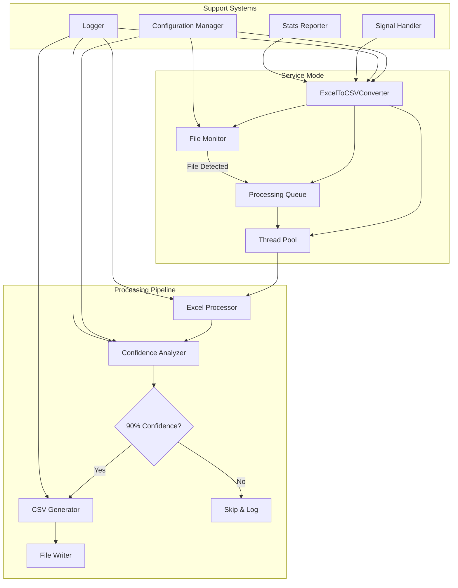

# Design Document

## Overview

The Excel-to-CSV converter is a Python-based automated data processing system that monitors configured directories for Excel files and intelligently extracts worksheet data as CSV files. The system employs a modular architecture with separate components for file monitoring, Excel analysis, confidence scoring, and CSV generation. The design follows Python best practices with clear separation of concerns, robust error handling, and configurable behavior.

## Steering Document Alignment

### Technical Standards (tech.md)
Since no tech.md exists, this design follows Python community standards:
- PEP 8 code style guidelines
- Type hints for better code documentation and IDE support
- Structured logging using the standard logging module
- Configuration management using YAML/JSON formats
- Virtual environment for dependency isolation

### Project Structure (structure.md)
Following standard Python project organization:
- Source code in `src/` directory
- Configuration files in `config/` directory
- Tests in `tests/` directory with mirror structure
- Documentation in `docs/` directory
- Entry point scripts in project root

## Code Reuse Analysis

### Existing Components to Leverage
This is a new project, so we'll build on established Python ecosystem libraries:
- **pandas**: For Excel reading and CSV writing operations
- **openpyxl**: For detailed Excel worksheet analysis and metadata extraction
- **watchdog**: For filesystem monitoring and event handling
- **pyyaml**: For configuration file parsing
- **pathlib**: For robust file path operations

### Integration Points
- **File System**: Direct integration with OS file system events
- **Configuration**: YAML/JSON configuration files for runtime behavior
- **Logging**: Python standard logging framework for monitoring and debugging

## Architecture

The system follows a pipeline architecture with event-driven file monitoring. Each component has a single responsibility and communicates through well-defined interfaces. The design emphasizes modularity to enable independent testing and future extensions.

### Modular Design Principles
- **Single File Responsibility**: Each module handles one aspect (monitoring, analysis, conversion, etc.)
- **Component Isolation**: Clear boundaries between file operations, Excel processing, and confidence analysis
- **Service Layer Separation**: Distinct layers for file I/O, business logic, and configuration management
- **Utility Modularity**: Focused utility modules for common operations like path handling and validation



## Components and Interfaces

### File Monitor Component
- **Purpose:** Watches configured directories for new/modified Excel files and triggers processing
- **Interfaces:** 
  - `start_monitoring(folders: List[Path]) -> None`
  - `stop_monitoring() -> None`
  - `on_file_event(event: FileSystemEvent) -> None`
- **Dependencies:** Configuration Manager, Logger
- **Reuses:** watchdog library for cross-platform file system monitoring

### Excel Processor Component
- **Purpose:** Opens Excel files and extracts worksheet metadata and data
- **Interfaces:**
  - `process_file(file_path: Path) -> List[WorksheetData]`
  - `extract_worksheet_data(worksheet: Worksheet) -> WorksheetData`
  - `get_worksheet_info(file_path: Path) -> List[WorksheetInfo]`
- **Dependencies:** pandas, openpyxl
- **Reuses:** pandas DataFrame structures for data manipulation

### Confidence Analyzer Component
- **Purpose:** Analyzes worksheet data to determine if it contains meaningful data tables
- **Interfaces:**
  - `analyze_worksheet(data: WorksheetData) -> ConfidenceScore`
  - `calculate_data_density(data: DataFrame) -> float`
  - `detect_headers(data: DataFrame) -> HeaderInfo`
  - `assess_data_consistency(data: DataFrame) -> ConsistencyScore`
- **Dependencies:** pandas, numpy for statistical analysis
- **Reuses:** pandas analysis functions and data type detection

### CSV Generator Component
- **Purpose:** Converts qualified worksheet data to properly formatted CSV files
- **Interfaces:**
  - `generate_csv(worksheet_data: WorksheetData, output_path: Path) -> Path`
  - `create_filename(source_file: str, worksheet_name: str) -> str`
  - `write_csv_with_encoding(data: DataFrame, path: Path) -> None`
- **Dependencies:** pandas, pathlib
- **Reuses:** pandas CSV writing functionality with custom formatting

### Configuration Manager Component
- **Purpose:** Loads and manages application configuration from files and environment
- **Interfaces:**
  - `load_config(config_path: Path) -> Config`
  - `get_monitored_folders() -> List[Path]`
  - `get_confidence_threshold() -> float`
  - `get_output_settings() -> OutputConfig`
- **Dependencies:** pyyaml, pathlib
- **Reuses:** Standard Python configuration patterns

### Logger Component
- **Purpose:** Provides structured logging with configurable levels and formats
- **Interfaces:**
  - `setup_logging(config: LoggingConfig) -> None`
  - `log_processing_start(file_path: Path) -> None`
  - `log_confidence_decision(worksheet: str, score: float, decision: bool) -> None`
  - `log_csv_generation(output_path: Path, record_count: int) -> None`
- **Dependencies:** Python logging module
- **Reuses:** Standard logging patterns and formatters

### Service Orchestrator Component (ExcelToCSVConverter)
- **Purpose:** Main application coordinator that integrates all components for both CLI and service modes
- **Interfaces:**
  - `run_service() -> None` - Start continuous monitoring service
  - `process_file(file_path: Path) -> bool` - Process single file (CLI mode)
  - `shutdown() -> None` - Graceful shutdown with cleanup
  - `get_statistics() -> Dict` - Current processing statistics
- **Dependencies:** All processing components, ThreadPoolExecutor, signal handling
- **Reuses:** Python threading, concurrent.futures, signal handling patterns

### CLI Interface Component
- **Purpose:** Command-line interface providing multiple operation modes
- **Interfaces:**
  - `service` command - Continuous monitoring mode
  - `process` command - Single file processing
  - `preview` command - Analysis without output generation
  - `stats` command - Processing statistics display
  - `config-check` command - Configuration validation
- **Dependencies:** Click framework, ExcelToCSVConverter
- **Reuses:** Click decorators and command patterns

## Data Models

### WorksheetData
```python
@dataclass
class WorksheetData:
    source_file: Path
    worksheet_name: str
    data: pd.DataFrame
    metadata: Dict[str, Any]
    confidence_score: Optional[float] = None
```

### ConfidenceScore
```python
@dataclass
class ConfidenceScore:
    overall_score: float
    data_density: float
    header_quality: float
    consistency_score: float
    reasons: List[str]
```

### Config
```python
@dataclass
class Config:
    monitored_folders: List[Path]
    confidence_threshold: float
    output_folder: Optional[Path]
    file_patterns: List[str]
    logging: LoggingConfig
    retry_settings: RetryConfig
```

### HeaderInfo
```python
@dataclass
class HeaderInfo:
    has_headers: bool
    header_row: Optional[int]
    header_quality: float
    column_names: List[str]
```

### OutputConfig
```python
@dataclass
class OutputConfig:
    folder: Optional[Path]
    naming_pattern: str
    encoding: str
    include_timestamp: bool
```

## Error Handling

### Error Scenarios
1. **File Access Denied:** Excel file is locked or insufficient permissions
   - **Handling:** Retry with exponential backoff, log warning, continue processing other files
   - **User Impact:** File skipped with clear log message indicating retry attempts

2. **Corrupt Excel File:** File cannot be opened or parsed
   - **Handling:** Log error with file details, continue processing remaining files
   - **User Impact:** Error logged with specific file path and corruption details

3. **Insufficient Disk Space:** Cannot write CSV output files
   - **Handling:** Log critical error, attempt to notify via configured channels, pause processing
   - **User Impact:** Processing stops with clear error message about disk space

4. **Configuration File Missing/Invalid:** Cannot load application settings
   - **Handling:** Use default configuration values, log warning about missing config
   - **User Impact:** Application runs with defaults, warning logged about configuration

5. **Network Drive Unavailable:** Monitored folder becomes inaccessible
   - **Handling:** Log error, continue monitoring other folders, attempt periodic reconnection
   - **User Impact:** Folder monitoring pauses with logged explanation and retry attempts

## Testing Strategy

### Unit Testing
- **Component Isolation**: Each component tested independently with mock dependencies
- **Confidence Algorithm**: Extensive testing of confidence scoring with various worksheet patterns
- **File Operations**: Test file reading, writing, and path operations with temporary test files
- **Configuration**: Test config loading with valid/invalid YAML files
- **Error Scenarios**: Test error handling paths with simulated failures

### Integration Testing
- **End-to-End Pipeline**: Test complete flow from file detection to CSV generation
- **Multi-file Processing**: Test concurrent processing of multiple Excel files
- **Configuration Integration**: Test various configuration combinations
- **File System Events**: Test real file system monitoring with actual file operations

### End-to-End Testing
- **Real Excel Files**: Test with various Excel file formats and structures
- **Large File Processing**: Test performance with large Excel files (50MB+)
- **Long-Running Monitoring**: Test extended monitoring periods for memory leaks
- **Configuration Changes**: Test hot-reloading configuration during operation
- **Error Recovery**: Test recovery from various failure scenarios

### Coverage Testing
- **Code Coverage Target**: Maintain minimum 90% line coverage across all modules
- **Branch Coverage**: Ensure all conditional branches are tested, especially in confidence analysis logic
- **Coverage Tools**: Use pytest-cov for coverage measurement and reporting
- **Coverage Enforcement**: Integrate coverage checks into CI/CD pipeline with failure thresholds
- **Exclusion Policy**: Exclude only trivial getters/setters and defensive assertions from coverage requirements
- **Coverage Reporting**: Generate HTML coverage reports for detailed analysis of untested code paths
- **Critical Path Coverage**: Ensure 100% coverage for core confidence scoring and file processing logic