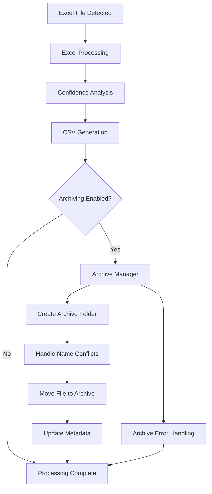

# Design Document

## Overview

The file archiving feature integrates seamlessly into the existing Excel-to-CSV processing pipeline to provide automated file organization after successful conversion. The design introduces a new `ArchiveManager` component that operates as a post-processing step, moving processed Excel files to structured archive folders within the monitored directories.

The archiving system follows the existing event-driven architecture pattern, triggering after CSV generation is complete. It maintains the principle of least disruption by operating independently from core processing logic while providing comprehensive error handling and logging consistent with the current system.

## Steering Document Alignment

### Technical Standards (tech.md)

The file archiving design strictly follows the established technical patterns:

- **Python 3.11+ Compatibility**: Uses modern type hints, Path objects, and async/await patterns where appropriate
- **pandas + openpyxl Integration**: Works with existing data models and file processing infrastructure
- **Configuration-Driven Design**: Extends the YAML configuration system with new archiving settings
- **Error Handling Standards**: Implements comprehensive exception handling with structured logging
- **Testing Framework Integration**: Designed for pytest testing with fixtures and mocking support

### Project Structure (structure.md)

The implementation follows the established directory organization and naming conventions:

- **Module Location**: New `src/excel_to_csv/archiving/archive_manager.py` following the single-responsibility pattern
- **Configuration Integration**: Extends existing `config_manager.py` with archiving settings
- **Data Model Extension**: Adds archiving metadata to existing `WorksheetData` model
- **Naming Conventions**: Uses `snake_case` for functions, `PascalCase` for classes, consistent with project standards
- **Import Patterns**: Follows the established standard library → third-party → local import order

## Code Reuse Analysis

### Existing Components to Leverage

- **ConfigManager**: Extend existing configuration loading and validation to include archiving settings
- **WorksheetData Model**: Add archive status tracking fields to existing data structure  
- **Logger Utilities**: Reuse `get_processing_logger()` and structured logging patterns from `utils.logger`
- **Path Handling**: Leverage existing `pathlib.Path` usage patterns throughout the codebase
- **Error Classes**: Create archiving-specific exceptions that inherit from existing base exception patterns

### Integration Points

- **ExcelToCSVConverter**: Integrate archiving calls into the `_process_file_pipeline()` method after CSV generation
- **Configuration System**: Extend the `Config` dataclass and `DEFAULT_CONFIG` with archiving options
- **File Monitor**: Archive operations work transparently with existing file system monitoring
- **Logging Infrastructure**: Archive operations log to the same structured logging system used by other components

## Architecture

The archiving system follows a service-oriented design pattern that integrates cleanly with the existing pipeline architecture. The `ArchiveManager` operates as an independent service that can be enabled/disabled without affecting core processing functionality.

### Modular Design Principles

- **Single File Responsibility**: `archive_manager.py` handles only file archiving operations and related utilities
- **Component Isolation**: Archive functionality is completely decoupled from Excel processing and CSV generation logic
- **Service Layer Separation**: Archiving operates as a post-processing service with clear input/output contracts
- **Utility Modularity**: Archive path generation, conflict resolution, and validation are separate focused functions



## Components and Interfaces

### ArchiveManager

- **Purpose:** Manages the complete file archiving workflow including folder creation, conflict resolution, and file movement
- **Interfaces:** 
  - `archive_file(file_path: Path, archive_config: ArchiveConfig) -> ArchiveResult`
  - `create_archive_folder(base_folder: Path) -> Path`  
  - `resolve_naming_conflicts(target_path: Path) -> Path`
- **Dependencies:** `pathlib`, `logging`, configuration objects, file system permissions
- **Reuses:** Logger utilities from `utils.logger`, Path validation patterns from existing codebase

### ArchiveConfig

- **Purpose:** Configuration data structure containing all archiving-related settings
- **Interfaces:**
  - Properties: `enabled: bool`, `archive_folder_name: str`, `timestamp_format: str`
  - Validation: `validate() -> None`
- **Dependencies:** dataclass, validation utilities
- **Reuses:** Configuration patterns from existing `Config` classes

### ArchiveResult

- **Purpose:** Data container for archive operation results and metadata
- **Interfaces:**
  - Properties: `success: bool`, `source_path: Path`, `archive_path: Path`, `error_message: str`
  - Methods: `was_successful() -> bool`, `get_error_details() -> Dict[str, Any]`
- **Dependencies:** dataclass, pathlib
- **Reuses:** Result object patterns from existing processing components

### ArchiveError

- **Purpose:** Custom exception class for archiving-specific errors
- **Interfaces:**
  - Standard exception interface with detailed error context
  - Error categorization (permission, file system, configuration)
- **Dependencies:** Base exception classes
- **Reuses:** Error handling patterns from `ExcelProcessingError`, `CSVGenerationError`

## Data Models

### ArchiveConfig
```python
@dataclass
class ArchiveConfig:
    enabled: bool = True
    archive_folder_name: str = "archive"
    timestamp_format: str = "%Y%m%d_%H%M%S"
    handle_conflicts: bool = True
    preserve_structure: bool = True
```

### ArchiveResult
```python
@dataclass
class ArchiveResult:
    success: bool
    source_path: Path
    archive_path: Optional[Path] = None
    timestamp_used: Optional[str] = None
    error_message: Optional[str] = None
    operation_time: float = 0.0
```

### Extended WorksheetData
```python
# Extension to existing WorksheetData class
@dataclass
class WorksheetData:
    # ... existing fields ...
    archive_result: Optional[ArchiveResult] = None
    archived_at: Optional[datetime] = None
```

### Extended Config
```python
# Extension to existing Config class  
@dataclass
class Config:
    # ... existing fields ...
    archive_config: ArchiveConfig = field(default_factory=ArchiveConfig)
```

## Error Handling

### Error Scenarios

1. **Permission Denied Creating Archive Folder**
   - **Handling:** Log error, attempt to use existing folder permissions, graceful fallback to skip archiving
   - **User Impact:** Processing continues successfully, warning logged about archiving failure

2. **File Locked During Archive Operation**
   - **Handling:** Implement retry logic with exponential backoff, timeout after 30 seconds
   - **User Impact:** Temporary delay, retry attempts logged, eventual fallback to processing without archiving

3. **Insufficient Disk Space in Archive Location**
   - **Handling:** Catch file system errors, log detailed error message, continue without archiving
   - **User Impact:** Processing continues normally, administrator notified via error log

4. **Network Drive Connectivity Issues**
   - **Handling:** Implement timeout and retry mechanisms, graceful degradation to local processing
   - **User Impact:** Temporary processing delay, automatic recovery when connectivity restored

5. **Archive Folder Already Contains Files with Same Name**
   - **Handling:** Append timestamp suffix, increment counter if multiple conflicts per second
   - **User Impact:** Files archived with unique names, conflict resolution logged

## Testing Strategy

### Unit Testing
- **ArchiveManager Class**: Test all public methods with mock file systems and permission scenarios
- **Configuration Integration**: Verify proper loading and validation of archiving configuration options
- **Path Generation**: Test archive folder creation, name conflict resolution algorithms
- **Error Conditions**: Mock various file system errors and validate graceful handling

### Integration Testing
- **End-to-End Archiving**: Process real Excel files and verify complete archiving workflow
- **Configuration Changes**: Test enabling/disabling archiving during runtime
- **File System Integration**: Test with various file systems, permissions, and network drives
- **Concurrent Operations**: Verify archiving works correctly with multiple simultaneous file processing

### End-to-End Testing
- **Service Mode**: Run full service with archiving enabled, verify files are archived after processing
- **CLI Mode**: Test single file processing with archiving enabled and disabled
- **Error Recovery**: Test system behavior when archiving fails mid-operation
- **Performance Impact**: Measure processing time with and without archiving to verify <5% overhead requirement